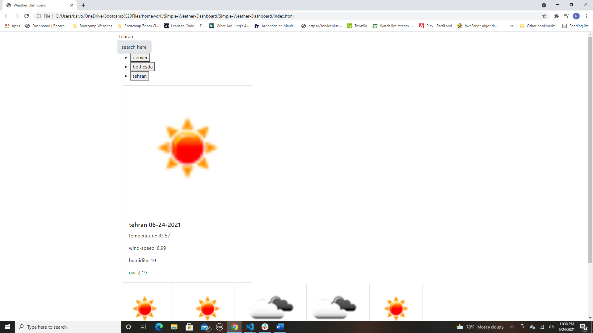

# Simple-Weather-Dashboard

## Description 

This is a simple weather website that gives you the current and next 5 day weather forcast of any city around the world. It saves your past searches as a button under the search bar so that if you need to go back to the city you searched for you can just click the button instead of going back and typing the name of the desired city in the search bar. 

## Usage

Just type in your desired city into the search bar and click the search here button. It will display the current day's weather and then underneath the next 5 days. 

## Link to my github account: 

https://github.com/kaivont85/Simple-Weather-Dashboard

## Screenshot of Deployed Website

  
  
  
  
